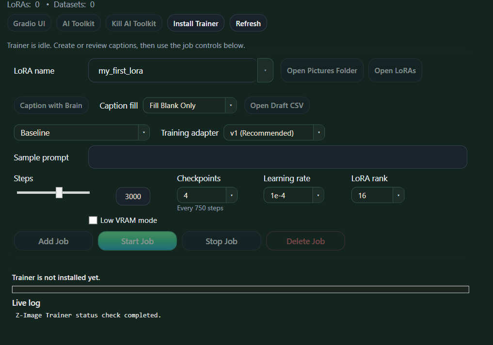

# Easy LoRA Module Handoff

Date: 2026-05-15

## Goal

Port the old main-branch Z-Image Trainer into the modular `LoRA` module.

The module is named:

```text
LoRA
```

The beginner UI is named:

```text
Easy LoRA
```

The advanced official UI keeps its existing name:

```text
AI Toolkit
```

## Important Rule

Use `NymphsCore` `main` as the reference implementation.

The old Manager trainer took days to get right. This is the most complex module in the first module set and should be ported closely, not reimagined.

Every implementation pass should keep the old `NymphsCore` `main` Manager code open as the behavioral reference. Treat the old code as the parity target for workflow, edge cases, defaults, API calls, progress parsing, caption behavior, and recovery behavior.

Do not make a LoRA module change from memory if the old Manager already implemented that part. Check the old files first, then port the behavior into module-owned scripts/UI/actions.

When simplifying, only simplify after deliberately confirming one of these is true:

- the old behavior was Manager-shell-specific and no longer belongs in the module
- the new module standard replaces the old mechanism without changing user-visible behavior
- a fallback is being added while preserving the AI Toolkit job flow as the product path
- the change is explicitly documented as a deliberate behavior change

Do not treat this as a simple UI wrapper or shell script launcher. The old implementation coordinates:

- local Brain LLM captioning
- dataset folder and `metadata.csv` management
- preserving and filling captions
- converting CSV captions into individual sidecar `.txt` files
- AI Toolkit install/bootstrap
- AI Toolkit API settings
- AI Toolkit job registration/upsert
- AI Toolkit queue start/stop/delete/log polling
- progress parsing from toolkit logs
- model and adapter readiness checks

Do not replace its AI Toolkit job flow with a simpler direct-run flow unless deliberately adding a fallback.

Source of truth references:

```text
NymphsCore origin/main:
Manager/apps/NymphsCoreManager/Views/MainWindow.xaml
Manager/apps/NymphsCoreManager/ViewModels/MainWindowViewModel.cs
Manager/apps/NymphsCoreManager/Services/InstallerWorkflowService.cs
Manager/apps/NymphsCoreManager/Models/ZImageTrainerStatus.cs
Manager/scripts/install_zimage_trainer_aitk.sh
Manager/scripts/zimage_trainer_status.sh
Manager/scripts/zimage_caption_brain.sh
Manager/scripts/zimage_caption_brain.py
Manager/scripts/ztrain_run_config.sh
```

Current module repo:

```text
NymphsModules/lora
```

## Current State Snapshot

This section reflects the local modular build after the 2026-05-15 install,
asset-fetch, Easy LoRA wiring, status UX, and button-label cleanup passes.

The module is installable and visible in the standard Manager module shell.
Easy LoRA now has the original module action flow wired through AI Toolkit,
including local/API current-job settings import into the form.

Relevant pushed heads before this handoff update:

```text
NymphsCore modular: 0088baa  module UI rail label is Close UI
```

The live test WSL install was updated in place to LoRA `0.1.32` without
reinstalling or redownloading training assets.

### Done

- `LoRA` exists as a first-party module repo with manifest version `0.1.32`.
- The Manager can install, update, repair, uninstall, and delete LoRA data using
  the standard module lifecycle rail.
- Base install creates the isolated trainer root:

```text
/home/nymph/LoRA
```

- Base install prepares the AI Toolkit checkout, Python venv, local Node 20,
  official AI Toolkit UI dependencies/build, Prisma DB, launcher scripts,
  module scripts, and module UI files.
- Base install no longer downloads the huge training weights.
- `Fetch Training Assets` is a separate explicit action and now reports useful
  progress while downloading/resuming:

```text
Tongyi-MAI/Z-Image-Turbo
ostris/zimage_turbo_training_adapter
```

- LoRA status reports `assets_ready=true` when the model bundle, adapter, and
  `.training-assets-ready` marker are all present.
- The Manager details pane only shows the `Fetch Training Assets` next-step
  prompt while the module state is actually `Needs assets`.
- `Easy LoRA` opens `ui/manager.html` inside Manager WebView2.
- `AI Toolkit`, `Open Datasets`, `Open LoRAs`, and `Logs` actions are exposed
  as module actions.
- Module-owned dataset/caption helpers now normalize names, create selected
  dataset folders, refresh `metadata.csv`, preserve existing captions, and
  mirror captions to sidecar `.txt` files.
- `Open Pictures` and `Open Captions` in `Easy LoRA` now call module actions
  for the selected normalized LoRA name. `Open Captions` prepares
  `metadata.csv` and mirrors `.txt` captions before reporting the path.
- `Caption with Brain` is now module-owned and wired from `Easy LoRA`. It ports
  the old Manager Brain vision workflow: prepare metadata, find/reuse/start a
  compatible Brain vision model, draft captions through the local
  OpenAI-compatible Brain endpoint, then refresh metadata and mirror `.txt`
  sidecars.
- `Create Job` is now module-owned and wired from `Easy LoRA`. It prepares
  metadata, mirrors sidecar `.txt` captions, ensures the selected adapter,
  generates the old-style AI Toolkit YAML, writes `nymphs_lora.json`, builds the
  AI Toolkit JSON `job_config`, starts/configures AI Toolkit if needed, and
  upserts the train job through `/api/jobs`.
- `Start Training` is now module-owned and wired from `Easy LoRA`. It starts the
  AI Toolkit queue worker when available, ensures the AI Toolkit API/settings
  are ready, finds the selected job by `job_ref`, calls
  `/api/jobs/{id}/start`, and waits for AI Toolkit to report `queued` or
  `running`.
- `Stop Job` is now module-owned and wired from `Easy LoRA`. It uses the active
  AI Toolkit train job, calls `/api/jobs/{id}/mark_stopped` for queued jobs, and
  calls `/api/jobs/{id}/stop` for running jobs.
- `Delete Job` is now module-owned and wired from `Easy LoRA`. It finds the
  selected job by normalized `job_ref` and calls `/api/jobs/{id}/delete` without
  deleting datasets, images, captions, or generated LoRA files.
- `Status` / `job_status` is now module-owned and wired from `Easy LoRA`. It
  reports local YAML/metadata/final-checkpoint state without launching AI
  Toolkit, and when the AI Toolkit API is running it fetches the selected job,
  `/api/jobs/{id}/log`, parsed progress, and a log tail.
- The Manager now has a generic WebView2 `module_action` message bridge for
  installed manifest-declared module actions. Easy LoRA uses it to poll
  `job_status` in-place without navigating away to the Manager Logs page.
- The Manager LoRA details/status display now separates module readiness from
  AI Toolkit backend state. `running=true` from the module means the AI Toolkit
  UI/worker is running, not that training is active.
- The LoRA action labels now distinguish the surfaces:

```text
Easy LoRA         -> beginner UI inside Manager
Open AI Toolkit   -> advanced AI Toolkit backend/UI
Stop AI Toolkit   -> stops the AI Toolkit UI/worker only
```

- Easy LoRA now replaces the placeholder progress/log block with in-place
  `job_status` results: parsed percent, step count, AI Toolkit state, progress
  text, final checkpoint completion, and log tail.
- Easy LoRA now renders finished output state from module-owned status:
  selected final checkpoint path/size/time, saved activation text, and a latest
  finished LoRA fallback when the selected LoRA is not complete yet.
- `job_status` now imports saved Easy LoRA form settings from the AI Toolkit
  job config when available, with module YAML/metadata as a no-launch fallback.
  Easy LoRA hydrates preset, steps, checkpoint count, learning rate, rank,
  adapter, low-VRAM mode, and sample prompt once per selected LoRA name.
- Easy LoRA now checks `job_status` before starting AI Toolkit on page load. If
  the AI Toolkit API is already running, reopening Easy LoRA skips the startup
  action and hydrates from status immediately.
- `Delete Data` is separate from uninstall and is available through the
  universal rail.

### Partially Done

- The Easy LoRA page visually contains the right controls, polls/renders
  `job_status` in-place, and exposes final/latest output state. `Open Pictures`,
  `Open Captions`, `Caption with Brain`, `Create Job`, `Start Training`, `Stop
  Job`, `Delete Job`, and `Status` are wired through module actions.
- The Manager has a basic local HTML action hook:

```text
nymphs-module-action://<action>?key=value
```

It can run installed module entrypoints declared in `nymph.json`. The newer
WebView2 `module_action` message bridge is used for in-place `job_status`
polling so Easy LoRA can update without navigating to the Manager Logs page.
- The old main-branch AI Toolkit job flow still exists in `NymphsCore`
  Manager code and should be ported, not rewritten from memory.

### Not Done

No original handoff button/action entrypoints remain unwired. Remaining work is
real-run validation, UI edge-case polish, and any deliberate fallback behavior
that should exist alongside the AI Toolkit product path.

### Current User-Visible Reality

When `Easy LoRA` opens today, it is a compact module-owned training surface.
`Open Pictures`, `Open Captions`, `Caption with Brain`, `Create Job`,
`Start Training`, `Stop Job`, `Delete Job`, and `Status` are wired through
module actions. The progress bar and log text are now populated from
`job_status`, and finished LoRAs are summarized when a selected or recently
completed `.safetensors` output exists:

```text
Finished: My First LoRA
/home/nymph/LoRA/loras/my_first_lora/my_first_lora.safetensors
Activation: my_first_lora
```

Saved job settings are imported back into the form from AI Toolkit when
available, or from local module YAML/metadata when AI Toolkit is closed.

### Current Module Actions

Declared in `nymph.json`:

```text
easy_lora      -> opens module UI
fetch_assets   -> downloads/resumes training assets
aitoolkit      -> starts/opens official AI Toolkit
open_datasets  -> opens /home/nymph/LoRA/datasets
open_loras     -> opens /home/nymph/LoRA/loras
open_pictures  -> creates/prints selected dataset folder
open_captions  -> refreshes selected metadata.csv and mirrors .txt captions
prepare_dataset -> refreshes selected metadata.csv and mirrors .txt captions
caption_brain  -> drafts captions with Brain vision model and mirrors .txt captions
create_job     -> generates YAML/job_config and upserts an AI Toolkit train job
start_job      -> starts selected AI Toolkit job through /api/jobs/{id}/start
stop_job       -> stops active AI Toolkit train job through stop/mark_stopped
delete_job     -> deletes selected AI Toolkit job through /api/jobs/{id}/delete
job_status     -> reports local/API job state, parsed progress, log tail, finished LoRAs, and form settings
logs           -> tails LoRA/AI Toolkit logs
```

No remaining module action entrypoint names from the original handoff are
undeclared. The remaining work is real training validation and polishing edge
cases around live AI Toolkit state.

Newly declared in module version `0.1.12`:

```text
open_pictures
open_captions
prepare_dataset
```

Newly declared in module version `0.1.13`:

```text
caption_brain
```

Newly declared in module version `0.1.14`:

```text
create_job
```

Newly declared in module version `0.1.15`:

```text
start_job
```

Newly declared in module version `0.1.16`:

```text
stop_job
delete_job
```

Newly declared in module version `0.1.17`:

```text
job_status
```

New in module version `0.1.18`:

```text
Easy LoRA in-place job_status polling/rendering through the Manager WebView2
module_action bridge.
```

New in module version `0.1.19`:

```text
job_status finished-LoRA discovery plus Easy LoRA final/latest output summary.
```

New in module version `0.1.28`:

```text
Easy LoRA saved-job settings import into the form, using AI Toolkit job_config
when available and local YAML/metadata as fallback.
```

New in module version `0.1.29`:

```text
Manager action labels changed from AI Toolkit / Stop LoRA to
Open AI Toolkit / Stop AI Toolkit.
```

New in module version `0.1.30`:

```text
Easy LoRA reopen fast path. The page checks job_status first and only starts
AI Toolkit if the API is not already running. lora_easy_lora.sh also skips the
UI/worker launchers when they are already alive.
```

New in module version `0.1.31`:

```text
Easy LoRA checkpoint summary now updates when steps/checkpoint count changes
and matches the old Manager math: no checkpoints when count is 0, otherwise
floor(steps / checkpoint_count).
```

New in module version `0.1.32`:

```text
Easy LoRA visible preset labels/order restored to main Manager parity:
Fast Test, Baseline, Style, Strong Style.
```

Related Core modular change:

```text
NymphsCore modular 6274d62:
LoRA stopped        -> LoRA: Ready
AI Toolkit running  -> LoRA: AI Toolkit running
active train job    -> LoRA: Training active / LoRA: Training queued

The details pane now shows AI Toolkit UI/worker state, assets, counts, and
folder path instead of generic Health/Runtime/Data booleans.
```

## Current Architecture Decision

The Manager should not regain a hardcoded LoRA page.

The Manager owns:

- module shell
- sidebar
- module details pane
- install/update/uninstall rail
- logs page
- generic action routing
- WebView2 hosting

The LoRA module owns:

- installer
- status/start/stop/open/logs actions
- Easy LoRA UI
- AI Toolkit launch action
- dataset/caption/job helpers
- AI Toolkit API integration

## UI Shape

The module detail page should show module-level facts only. Do not duplicate the full Easy LoRA form there.

Suggested details pane:

```text
LoRA
Local LoRA training module powered by AI Toolkit.

Status
Installed: yes/no
Trainer: ready/missing
LoRAs: N
Datasets: N
AI Toolkit: running/stopped
Training backend: Z-Image Turbo initially, future runtimes later
Model files: ready/missing
Adapter: ready/missing

Folders
Datasets
LoRAs
Jobs
Logs
```

Module actions should include:

```text
Easy LoRA
Open AI Toolkit
Stop AI Toolkit
Open LoRAs
Open Datasets
Logs
```

`Easy LoRA` opens the module-owned beginner HTML UI.

`Open AI Toolkit` opens the official AI Toolkit UI. It may open in Manager WebView2 or external browser depending on current Manager support/action result.

`Stop AI Toolkit` stops the AI Toolkit UI/worker. It does not uninstall LoRA,
delete data, or mean that the LoRA module is no longer ready.

Gradio can remain as a dev/hidden script if useful, but it should not be part of the beginner Easy LoRA surface.

## Easy LoRA UI

Easy LoRA should be compact. It should not recreate the whole Manager page.

Manager-owned module state should not be repeated inside the HTML. Keep install state, LoRA/dataset counts, queue/backend health, AI Toolkit launch, and module folder shortcuts in the Manager details/actions area.

It should contain only the trainer controls:

```text
LoRA name
Open Pictures
Caption with Brain
Caption fill mode
Open Captions
Preset
Training adapter
Sample prompt
Steps
Checkpoints
Learning rate
LoRA rank
Low VRAM mode
Create Job
Start Training
Stop Job
Delete Job
Progress
Live log / status
```

The progress bar belongs in the Easy LoRA HTML because it is current-job workflow state.

Because this will likely run inside Manager WebView2, the HTML must handle narrow embedded widths gracefully:

- desktop/wide: compact multi-column form
- medium WebView widths: label + content rows, action buttons wrap under fields
- narrow widths: single-column controls
- job buttons should become two-column, then one-column
- button text should wrap instead of forcing horizontal overflow

Use the old screenshot/layout as the workflow reference, but polish the styling.



Labels agreed in discussion:

```text
Module: LoRA
Easy UI/button: Easy LoRA
Advanced UI/button: AI Toolkit
```

Avoid:

```text
Nymph Trainer
Nymphs Trainer
Z-Image Trainer as the module/page title
```

## Easy LoRA Wiring Decision

The current Manager can intercept this URL scheme from local module HTML:

```text
nymphs-module-action://create_job?lora=my_first_lora
```

The action name must be present in the module capabilities, which currently
come from `entrypoints` in `nymph.json`.

Current limits:

- query args become CLI flags, for example `?lora=my_first_lora` becomes
  `--lora my_first_lora`
- argument values are intentionally restricted to short safe strings
- the Manager currently changes to the Logs page while the action runs
- the HTML does not receive a structured response payload

This is enough for smoke-test buttons and simple actions. It is not enough for
the final Easy LoRA experience unless the UX accepts leaving the page during
each action.

Recommended approach for the real trainer UI:

1. Add a module-owned lightweight local helper API for Easy LoRA, or extend the
   Manager module-UI bridge to support structured request/response without
   leaving the WebView.
2. Keep all LoRA/AI Toolkit logic module-owned.
3. Let the HTML poll `job_status` and `job_log` frequently while a job exists.
4. Use the existing Manager action scheme only as a fallback for one-shot
   actions until a better bridge exists.

## The Critical Job Flow

Easy LoRA must send jobs to AI Toolkit the way `main` does.

Required behavior:

```text
Easy LoRA form values
-> normalize LoRA/dataset name
-> prepare dataset metadata.csv
-> mirror metadata.csv captions to per-image .txt files
-> ensure selected training adapter exists
-> generate AI Toolkit YAML job
-> generate AI Toolkit JSON job_config
-> upsert/register job through AI Toolkit API
-> job appears in AI Toolkit Jobs
-> Start Training queues/starts the AI Toolkit job
```

Do not reduce this to only:

```text
python run.py jobs/name.yaml
```

That direct runner exists in the old script and may be useful as fallback, but the product flow is AI Toolkit registration and queue control.

## Main-Branch Port Map

The old working behavior is concentrated in these Manager methods. These are
the practical port checklist.

From `Manager/apps/NymphsCoreManager/ViewModels/MainWindowViewModel.cs`:

```text
RefreshZImageTrainerStatusAsync
RefreshZImageTrainerLiveStateAsync
CreateZImageTrainerJobAsync
OpenZImageTrainerPicturesFolderAsync
OpenZImageTrainerCaptionsFileAsync
DraftZImageTrainerCaptionsAsync
StartZImageTrainingAsync
StartZImageTrainerQueueAsync
StopZImageTrainerQueueAsync
DeleteZImageTrainerJobAsync
ViewZImageTrainerJobAsync
LaunchZImageTrainerOfficialUiAsync
KillZImageTrainerOfficialUiAsync
TryImportZImageTrainerJobSettingsAsync
ApplyZImageTrainerPresetDefaults
UpdateZImageTrainerProgressFromLine
```

From `Manager/apps/NymphsCoreManager/Services/InstallerWorkflowService.cs`:

```text
GetZImageTrainerStatusAsync
GetZImageTrainerDatasetNamesAsync
GetZImageTrainerJobSettingsAsync
CreateZImageTrainerJobAsync
RunZImageTrainerJobAsync
StartZImageTrainerQueueAsync
StopZImageTrainerQueueAsync
DeleteZImageTrainerJobAsync
GetZImageTrainerJobIdAsync
TryGetZImageTrainerJobLogAsync
StopZImageTrainerJobAsync
EnsureZImageTrainerPicturesFolderAsync
PrepareZImageTrainerMetadataAsync
EnsureZImageTrainerTrainingAdapterAsync
DraftZImageTrainerCaptionsAsync
BuildZImageTrainerConfig
BuildZImageTrainerConfigJson
BuildZImageLoraMetadataJson
TryRegisterZImageTrainerJobInOfficialUiAsync
FindOfficialUiJobIdAsync
QueueOfficialUiJobAsync
EnsureAiToolkitApiReadyAsync
EnsureAiToolkitSettingsConfiguredAsync
EnrichZImageTrainerStatusFromAiToolkitAsync
TryGetAiToolkitDatasetVisibilityAsync
UpsertAiToolkitJobViaApiAsync
TryGetAiToolkitJobByRefAsync
GetAiToolkitActiveTrainJobAsync
WaitForAiToolkitJobLiveStateAsync
SendAiToolkitApiRequestAsync
ReadTrainerMetadata
WriteTrainerMetadata
SyncTrainerCaptionTextFiles
```

The port should move this behavior into module-owned helpers, probably:

```text
scripts/lora_job.py
scripts/lora_caption_brain.sh
scripts/lora_caption_brain.py
scripts/lora_create_job.sh
scripts/lora_start_job.sh
scripts/lora_stop_job.sh
scripts/lora_delete_job.sh
scripts/lora_job_status.sh
scripts/lora_open_pictures.sh
scripts/lora_open_captions.sh
```

Keep the C# code open during implementation and port behavior in small slices.

## AI Toolkit API Endpoints From Main

The old Manager talks to AI Toolkit on:

```text
http://127.0.0.1:8675
```

Important endpoints:

```text
GET  /api/settings
POST /api/settings
GET  /api/jobs?job_ref=<name>
GET  /api/jobs?id=<id>
GET  /api/jobs?job_type=train
POST /api/jobs
GET  /api/jobs/<id>/start
GET  /api/jobs/<id>/stop
GET  /api/jobs/<id>/mark_stopped
GET  /api/jobs/<id>/delete
GET  /api/jobs/<id>/log
GET  /api/queue
GET  /api/queue/<gpu_ids>/start
GET  /api/queue/<gpu_ids>/stop
GET  /api/datasets/list
POST /api/datasets/listImages
```

The module should move this API glue into module-owned scripts/helpers, likely Python for JSON/HTTP handling.

## Dataset And Captions

Preserve main behavior:

- dataset folder is based on normalized LoRA name
- `metadata.csv` is the user-editable caption source
- supported image types:

```text
.png
.jpg
.jpeg
.webp
.bmp
```

- refreshing metadata keeps existing captions
- new image files get blank captions
- removed images disappear from metadata
- creating/updating a job mirrors `metadata.csv` captions to sidecar `.txt` files for AI Toolkit

User-facing language:

```text
Open Captions
```

is preferred over:

```text
Open Draft CSV
```

unless the old technical wording is intentionally kept.

## Caption With Brain

Preserve main behavior.

The old flow:

- finds or starts a compatible Brain vision model
- temporarily switches Brain to a vision model if needed
- sends normalized JPEG previews to Brain
- writes one caption per image into `metadata.csv`
- supports:

```text
fill_blanks
overwrite_all
```

- has special style-caption cleanup/retry logic

Important files:

```text
Manager/scripts/zimage_caption_brain.sh
Manager/scripts/zimage_caption_brain.py
```

These should be copied/migrated into the LoRA module, not kept as Manager-owned scripts.

## Presets And Controls

Main currently supports:

```text
Fast Test
Baseline
Style
Strong Style
```

Recent/docs language also mentions:

```text
Baseline
Style
Style High Noise
```

Resolve labels carefully during implementation. The old main behavior wins unless intentionally renamed.

Core defaults from main:

```text
baseline:
  steps: 3000
  checkpoints: 4
  learning_rate: 1e-4
  rank: 16
  resolution: 1024
  content_or_style: balanced

style:
  steps: 3000
  checkpoints: 4
  learning_rate: 1e-4
  rank: 16
  resolution: 1024
  content_or_style: balanced

strong_style:
  steps: 5000
  checkpoints: 4
  learning_rate: 1e-4
  rank: 16
  resolution: 1024
  content_or_style: content

fast_test:
  steps: 500
  checkpoints: 0
  learning_rate: 1e-4
  rank: 8
  resolution: 512
```

Training adapter:

```text
v1 (Recommended)
v2 (Experimental)
```

## Install Responsibilities

The module installer should continue to prepare:

- AI Toolkit checkout
- Python venv
- Torch/dependencies
- local Node 20
- official AI Toolkit UI deps/build
- Prisma DB
- launcher scripts
- helper scripts
- module manifest/UI files in the install root
- `.nymph-module-version` written last

Large training assets are intentionally a second explicit step:

- `scripts/lora_fetch_assets.sh`
- Manager action label: `Prepare Training Assets`
- downloads/resumes Z-Image Turbo model cache
- downloads/resumes `ostris/zimage_turbo_training_adapter`
- selects/writes `selected_adapter_path.txt`

This keeps base install from looking hung while multi-GB Hugging Face weights download.

Asset reality:

- Z-Image Turbo LoRA training still needs the full
  `Tongyi-MAI/Z-Image-Turbo` training bundle.
- Unlike Z-Image/TRELLIS inference modules, this is not currently a clean
  `int4_r32` / `Q5_K_M` style weight dropdown.
- The adapter repo contains separate adapter files, currently observed as:

```text
zimage_turbo_training_adapter_v1.safetensors
zimage_turbo_training_adapter_v2.safetensors
```

- The UI should expose adapter selection for training jobs.
- A future `Fetch Training Assets` selector could download `v1`, `v2`, or both,
  but the base Z-Image Turbo model bundle remains required for training.

Install root:

```text
/home/nymph/LoRA
```

Preserve user data on repair/uninstall unless purging:

```text
datasets
loras
jobs
config
logs
```

## Status Responsibilities

Status should be fast and key/value based.

It should report at least:

```text
id=lora
installed=true/false
runtime_present=true/false
data_present=true/false
version=<version>
repo_ready=true/false
venv_ready=true/false
node_ready=true/false
ui_ready=true/false
adapter_ready=true/false
model_ready=true/false
official_ui_running=true/false
queue_worker_running=true/false
queue_running=true/false
active_state=idle/queued/running/...
active_info=<text>
lora_count=N
dataset_count=N
running=true/false
state=available/installed/needs_assets/running/needs_attention
health=ok/degraded/missing
install_root=/home/nymph/LoRA
datasets=/home/nymph/LoRA/datasets
loras=/home/nymph/LoRA/loras
jobs=/home/nymph/LoRA/jobs
logs_dir=/home/nymph/LoRA/logs
marker=/home/nymph/LoRA/.nymph-module-version
detail=<human summary>
```

It should not run heavy model scans at Manager startup.

## Progress

Preserve the main progress behavior:

- parse `TRAIN_PROGRESS current=x total=y`
- parse common AI Toolkit warmup log lines
- detect final checkpoint save
- check final `.safetensors`
- poll AI Toolkit job log when available

This can be implemented in the Easy LoRA HTML plus module helper endpoint/action output, or in module scripts that print structured progress.

## Open Questions

1. Whether Easy LoRA should use a module-owned local helper API or a richer
   Manager WebView2 bridge for in-page structured actions.
2. Whether AI Toolkit should open inside Manager WebView2 by default or external
   browser by default.
3. Whether to expose Gradio as a hidden/dev action.
4. Whether preset labels should stay `Strong Style` or become `Style High Noise`.
5. Whether LoRA should download both adapter weights by default forever, or
   expose an adapter/weight selector during `Fetch Training Assets`.
6. How generic to make future training targets beyond Z-Image Turbo.

## Recommended Implementation Order

Completed already:

```text
install/update/status/uninstall wrappers
separate training asset fetch
standard lifecycle rail support
Easy LoRA local HTML surface
AI Toolkit/Open Datasets/Open LoRAs/Logs module actions
```

Next implementation pass:

1. Add module-owned helpers copied/ported from `NymphsCore origin/main`.
2. Start with dataset/caption file operations that do not require AI Toolkit:

```text
open_pictures
open_captions
prepare_metadata
sync_caption_txt
```

3. Add `job_status` that reports real state for one selected LoRA name:

```text
dataset exists/missing
metadata exists/missing
image_count
missing_caption_count
selected AI Toolkit job id/state/info
latest log tail
progress current/total/percent
final checkpoint exists
```

4. Add module-owned Python helper for AI Toolkit API/job operations.
5. Add job lifecycle module actions:

```text
create_job
start_job
stop_job
delete_job
```

6. Add Brain caption helpers and wire `Caption with Brain`.
7. Decide and implement the Easy LoRA HTML communication path:

```text
module-owned local helper API
or richer Manager WebView2 bridge
```

8. Wire `ui/manager.html` to real status/actions.
9. Test full AI Toolkit job roundtrip with a tiny dataset.
10. Only after that, polish UI styling.
